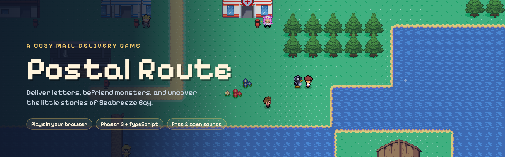

<p align="center">
  
</p>

# Postal Route: Seabreeze Bay

A cozy, browser-based mail-delivery game. You're the new courier in a sleepy seaside town:
pick up the mailbag each morning, deliver letters, befriend monsters, and slowly
uncover the little stories the townsfolk are writing to each other.

Built with **Phaser 3 + TypeScript + Vite**, using art from the open-source **Tuxemon** project.

## Play

```bash
npm install
npm run dev
```

Open http://localhost:5173.

| Key | Action |
| --- | --- |
| Arrows / WASD | Walk |
| E / Space / Enter | Talk, deliver, choose |
| TAB / Q | Open the mailbag |
| T | Townsfolk (hearts) |
| J | Journal (requests, items) |
| Esc / P | Pause |
| SHIFT | Zoom (once Bzz the bee joins) |
| M | Town map |
| N | Mute |

**On phones and tablets** an on-screen D-pad appears automatically: **A** to talk and deliver, **Bag** for the mailbag, **Map** for the town map, and tap anywhere to advance dialogue. Add `?touch` to the URL to force it on a desktop.

## The story
Your grandma Marlo ran the Seabreeze Post Office for forty years and left it to you. It's a little broke and a little boarded-up, and **Swiftline Logistics** (a drone-delivery company run by the smiling, ruthless **Director Hollis Vane**) already carries over half the town's mail. There's no deadline: every letter you deliver, every friend you make, takes mail back from the drones. **Spring** is 28 days; at the end of it the lighthouse is lit.

## How a day works
- **Home is the post office.** You live in the flat upstairs. The sorting hall has the **Helper Board**, the **Bulletin Board** and the **Projects Desk**. Postmaster Gull hands out the day's mail.
- **The clock is real-time** (about 12 minutes from 7am to midnight) and pauses in menus and dialogue. Sleep in your own bed.
- **Deliver the mail**: red mailboxes, or hand letters over in person. Most letters are notes between villagers who are friends, so the mail is the town talking.
- **Race the drones**: Swiftline drones patrol the square and fly out to deliver. Beat them to the mailbox or lose the delivery. As Swiftline's share grows, drone lockers appear in the square.
- **Trust and hearts**: every villager has trust (hearts). 3 hearts = a friend. Gifts, chats, favours and heart events raise it. Friends hear what you do for each other (gossip).
- **Your day is yours** once the bag is empty: take requests from the bulletin board (lost items, favours, parcel runs), forage flowers and shells for gifts, visit friends, shop.
- **Hire one helper a day** with a treat from Dot's Bakery. Each monster has a perk (more letters, faster, slows drones, rain tips, finds things) and a favourite treat; good friends help for free.
- **Spend your pay**: Projects Desk (patch the roof, new sorting desk, repaint the sign, open the old sorting room, rebuild the harbour footbridge), and Sable's bike shop (bikes, bags, paint).

## The places
Town Square (hub) · Harbour Village (+ a ferry dock for future villages) · Orchard Meadow · Lighthouse Point (opens when the footbridge is rebuilt). Only the post office has an interior.

## Write to a friend
At your desk upstairs you can write a real letter. It becomes a link; when a friend opens it, the letter arrives in their mailbag addressed to them, and the sender goes in their Postmark Book.

## How the world is built (no map editor)
- `src/world/layout.ts`: six maps described in code with `rect("water", …)`, `rect("stone", …)` and so on, plus buildings, warps between maps and the cast. The post office interior is baked from a Tuxemon room (`public/assets/interiors`).
- `src/game/schedule.ts`: where every villager is, hour by hour. Villagers walk real routes (BFS pathing) and fade through exits.
- `src/world/build.ts`: turns that into tile layers. Paths and shorelines are **autotiled** with a 4-corner bitmask; forests become 2×2 pine stamps with canopies drawn above the player.
- `src/data/stamps.json`: buildings, cut tile-for-tile from real Tuxemon maps.
- `src/game/letters.ts`: every letter and story thread. Add your own!

## Project layout
```
src/
  main.ts            Phaser config
  scenes/Boot.ts     asset loading + pixel props drawn in code
  scenes/World.ts    maps, movement, time, interaction dispatch
  scenes/UI.ts       HUD, dialogue, letters, map, townsfolk, pause, journal
  systems/           npcs (schedules, walking), mail, talk (gifts, shops, events),
                     office (helpers, projects, bed), requests, forage, drones,
                     calendar, intro, friends (letters by link)
  game/              state & saving, letters, schedule, helpers, items, heart events
  world/             layout (6 maps), autotiler, tile ids
```

Dev tip: `/?timer` keeps the game loop running in a background tab, and `window.game` is exposed in dev builds.

See [CREDITS.md](CREDITS.md) for licensing.
